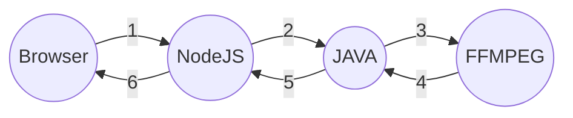

# IDM Project
ISTIC RENNES - FR    
Quentin Dubois    
2017-2018

# Introduction

Ce projet est un générateur de vidéo basé sur la librairie XTEND (DSL).   

Technologie utilisées : 
 -	NodeJS  (Application web / UI)
-	JAVA  pour la partie génération de vidéo aléatoire
-  FFMPEG pour la concaténation de vidéo  

Le projet est contenu dans le dossier DuboisQ, le reste des dossiers sont les fichiers necessaire a XTEND ainsi qu'a sa configuration.

**DuboisQ/WebAp**    
Application Web contenant serveur NodeJS, Runnable Jar (provenant de XtendProject), vidéos sources.          
    
**DuboisQ/XtendProject**    
Projet Xtend pour la prise en charge des .VideoGen

# Installation

clone le repo
cd DuboisQ/Webapp
npm start

# Utilisation

# Conclusion

